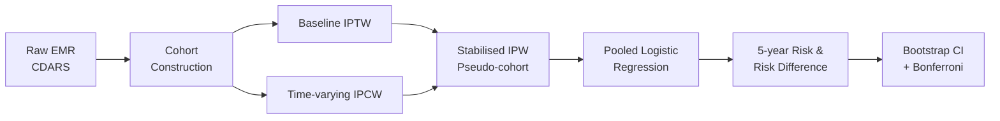

 

  <b>Comparative safety profiles of biologic and targeted synthetic DMARDs  
  in rheumatoid arthritis, using territory-wide electronic medical records  
  and causal inference to address time-varying confounding.</b>

---

## 📖 Background

> Rheumatoid arthritis (RA) is a chronic autoimmune disease whose management increasingly relies on **biologic and targeted synthetic DMARDs (b/tsDMARDs)**. Although these drugs are effective, their comparative safety profiles remain unclear — randomised trials are too short and too small to detect rare adverse events, while conventional observational studies are vulnerable to **time-varying confounding** and **selection bias**.

This study addresses that evidence gap using a **territory-wide EMR database** and **marginal structural models (MSM)** to estimate real-world, head-to-head safety comparisons across b/tsDMARD classes.

---

## 🎯 Objectives

- Compare 5-year safety profiles across **four b/tsDMARD classes** in RA patients.
- Address time-varying confounding via **inverse probability weighting (IPW)**.
- Provide robust, clinically actionable evidence to support personalised therapy.

---

## 🧪 Drug Classes Compared

<table align="center">
<tr>
  <th align="center">Class</th>
  <th align="center">Agents</th>
</tr>
<tr>
  <td align="center"><b>TNFi</b></td>
  <td>adalimumab · certolizumab pegol · <b>etanercept</b> (ref) · golimumab · infliximab</td>
</tr>
<tr>
  <td align="center"><b>IL-6i</b></td>
  <td>sarilumab · tocilizumab</td>
</tr>
<tr>
  <td align="center"><b>Lymphocyte-targeting</b></td>
  <td>abatacept · rituximab</td>
</tr>
<tr>
  <td align="center"><b>JAKi</b></td>
  <td>baricitinib · tofacitinib · upadacitinib</td>
</tr>
</table>

---

## 🏥 Data Source

- **Database:** Hong Kong Clinical Data Analysis and Reporting System (**CDARS**)
- **Coverage:** ~80% of routine hospital admissions in Hong Kong (7.3M residents)
- **Study period:** 1 Jan 2009 – 31 Dec 2023
- **Population:** Adult RA patients (ICD-9-CM 714.0) initiating ≥1 b/tsDMARD, excluding other autoimmune indications and non-RA rituximab uses.

---

## 🔬 Methods

### Analytical Framework

### Key Methodological Features

<b>📌 Marginal Structural Model (MSM)</b>

Handles variables like **ESR, CRP, csDMARDs, glucocorticoids, NSAIDs, opioids** that act simultaneously as **mediators** and **time-varying confounders** — a setting in which conventional regression is biased.

<b>📌 Stabilised Inverse Probability Weights</b>

- **Baseline IPTW:** addresses confounding by indication
- **Time-varying IPCW:** addresses informative censoring from treatment switching
- Final weight = IPTW × stabilised IPCW, truncated at 1st/99th percentiles
- Mean stabilised weights: **0.87–1.02** across all arms
- Balance assessed via **Love plots** (SMD < 0.1 for most covariates)

<b>📌 Outcome Modelling</b>

- **Pooled logistic regression** with visit-by-agent interactions for non-proportional hazards
- **5-year absolute risks & risk differences** vs. etanercept (reference)
- **1,000 bootstrap replicates** for pointwise 95% percentile CIs
- **Bonferroni correction** across 9 outcomes → CI level = 1 − 0.05/9

<b>📌 Competing Risk of Death</b>

Discrete-time **multi-state model** with three states (event of interest / death / no event) to avoid bias from treating deaths as censored.

<b>📌 Negative Control</b>

**Fracture** risk is used as a negative control outcome — no plausible association with b/tsDMARD class is expected. Any detected difference would signal residual confounding.

<b>📌 Missing Data</b>

- ESR/CRP missing rates: **36%–44%** throughout follow-up
- **Multiple Imputation by Chained Equations (MICE)** applied
- Drug doses standardised by **WHO Defined Daily Dose (DDD)**

---

## 📊 Outcomes Examined

| Cardiovascular | Infectious | Mental Health | Metabolic | Oncological | Other |
|:---:|:---:|:---:|:---:|:---:|:---:|
| MACE | Infection | Depression | Diabetes | Malignancy | Gastritis · Hospitalisation · Mortality |

*Plus **fracture** as negative control.*

---

## 📝 Citation

> *Manuscript under review. Full citation will be updated upon publication.*

---

## 🤝 Contact

For methodological questions or collaboration enquiries, please open an issue or contact the corresponding author.

Built with ❤️ for reproducible clinical research

